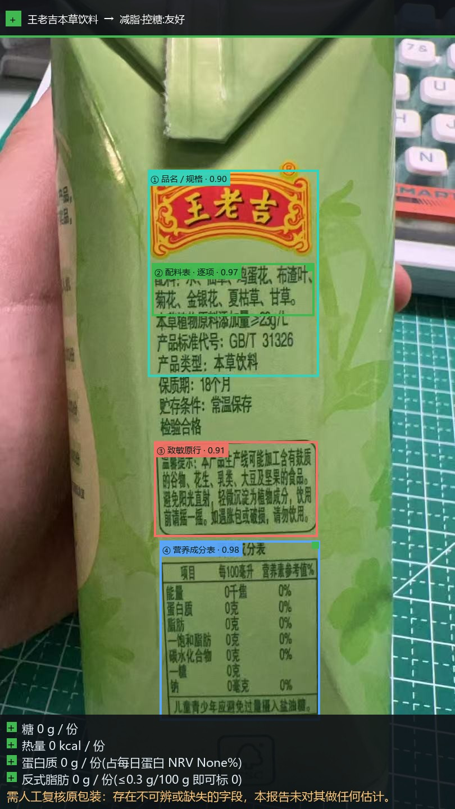

# 成分雷达（ingredient-radar-skill）

读取食品包装标签照片，结合用户**明确选择**的健身目标和过敏忌口，给出配料、营养成分与「是否适合吃」的判断。结论会保留原图定位框、原文依据和不确定性提示，便于人工核对。

本项目是供具备看图能力的 Agent 使用的 Skill：Agent 负责在照片中定位并抄录字段；Python 脚本负责每份折算、规则判定、过敏原匹配和结果图渲染。**只给脚本一张图片无法完成识别**，还需要 Agent 填写的 `--agent-json` 文件。

## 能做什么

- 定位品名、配料表、致敏原提示和营养成分表，并把结论关联回原图。
- 按 `gain`（增肌）、`cut`（减脂控糖）、`keto`（生酮）分别判定。
- 展示每 100 g 与每次食用量两个口径；默认按**整包**计算，也可手动指定克数。
- 区分直接含有的过敏原与「可能含有／共线生产」的交叉接触提示。
- 对看不清、缺失或 Agent 与规则引擎分歧的内容标注不确定，并提示人工复核。

只处理食品或保健食品的**包装标签照片**。风景、人像、账单和一般文档不在处理范围内；结果不是医疗诊断或饮食处方，过敏相关结论尤其需要核对原包装。

## 环境要求

- Python 3.8+
- Pillow（生成 `result.jpg` 时需要）
- 能接收图片并填写结构化 JSON 的 Agent

PyYAML 可选；未安装时会使用内置的 YAML 解析器。仓库脚本不依赖 GPU、CUDA 或其他 NVIDIA 软件栈，也没有外部模型 API Key 或推理端点。Agent 本身使用什么模型、硬件及图片处理方式，取决于运行它的平台。

在仓库根目录安装依赖并做本地检查：

```bash
python -m pip install Pillow
python scripts/main.py --probe
```

要作为 Skill 使用，请将**整个仓库**放入所用 Agent 的 Skill 目录，让它加载仓库根目录的 [SKILL.md](SKILL.md)。`scripts/`、`references/` 和规则文件需要与 `SKILL.md` 一起保留。

## 快速开始

1. 提供一张能看清配料表或营养成分表的食品包装照片，并**明确选择**目标：`gain`、`cut` 或 `keto`。如有过敏原或忌口，一并告诉 Agent；未指定时视为未勾选，结果不会替你推断。
2. 生成 Agent 输入模板：

   ```bash
   python scripts/main.py --dump-agent-template agent-input.json
   ```

3. 让 Agent 查看**同一张照片**，按照模板填写食品标签判断、四个区域的定位框与字段，以及目标结论分支。看不清的数值填 `null`，不要估算。模板中的坐标使用 0–1000 归一化口径；字段说明见 [Agent 模式文档](references/agent-mode.md)。
4. 运行本地判定。下面的命令以仓库内的示例照片为例，`agent-input.json` 必须根据这张照片填写：

   ```bash
   python scripts/main.py samples/sample_wafer.jpg --agent-json agent-input.json --goal cut --allergen 花生
   ```

正常运行会在默认的 `output/` 目录生成 `contract.json`、`report.json` 和带定位框的 `result.jpg`。终端回复最后一行的 `MEDIA:<绝对路径>` 指向结果图。若输入不是目标类型的食品标签，或找不到可用的配料／营养信息，程序会拒判，不生成结果图。

### 常用选项

| 选项 | 用途 |
| --- | --- |
| `--goal gain\|cut\|keto` | 指定健身目标；请显式传入，避免依赖命令行的 `cut` 默认值。 |
| `--allergen 花生` | 指定一种忌口；可重复传入，例如再加 `--allergen 乳`。 |
| `--serving-g 30` | 按手动指定的 30 g 计算；不填时按整包计算。 |
| `--all-goals` | 基于同一次抽取计算全部三个目标。 |
| `--json` | 只在标准输出打印契约 JSON。 |
| `--out-dir PATH` | 指定结果文件目录。 |
| `--age`、`--sex`、`--weight-kg`、`--height-cm`、`--activity` | 五项全部有效时，以个人估算的每日能量所需替代通用能量参考值；缺项则回退通用口径。 |
| `--goal-adjust` | 在个人维持热量估算上叠加目标乘数，默认关闭。 |

`--goal` 虽有命令行默认值，Skill 的交互规则仍要求 Agent 先让用户明确选择目标。完整参数以 `python scripts/main.py --help` 为准；环境变量示例见 [.env.example](.env.example)。

## 输出与复核

`contract.json` 包含产品、目标、每 100 g／每份营养数据、结论、过敏命中、定位证据、所用参考分母及复核状态。`report.json` 额外保留 Agent 的输入 JSON，便于追溯这次读图结果。若 Agent 选的结论分支与本地规则重算不一致，契约会记录 `verdict_divergence` 并要求人工复核。

退出码：`0` 表示完成；`2` 表示输入或 Agent JSON 有问题；`3` 表示拒判。运行失败返回 `1`。拒判时不输出 `MEDIA:` 行。

脚本不主动发起网络请求；照片交给 Agent 后如何处理，须以你使用的 Agent 平台为准。不要把脚本的「无网络代码」理解为任何 Agent 平台都在设备上离线看图。

## 评测

仓库提供样例图片和固化的 Agent 抽取结果，可回放本地规则与输出链路：

```bash
python evals/run_evals.py --samples samples --out REPORT.md
```

评测使用 `evals/fixtures/` 中已有的抽取结果，**不衡量 Agent 重新看图时的识别一致性**。运行后在 `REPORT.md` 查看逐例结果。



## 进一步阅读

- [SKILL.md](SKILL.md)：触发条件、操作边界和输出契约
- [Agent 模式](references/agent-mode.md)：输入模板、字段规则与分歧检测
- [判定规则](scripts/rules.yaml)：阈值与文案
- [法规口径](references/regulations.md) 与 [过敏原映射](references/allergen-map.md)
- [Skill Card](skill-card.md)：依赖、风险与已做的验证

许可：Apache-2.0（见 [SKILL.md](SKILL.md) 的元数据）。
