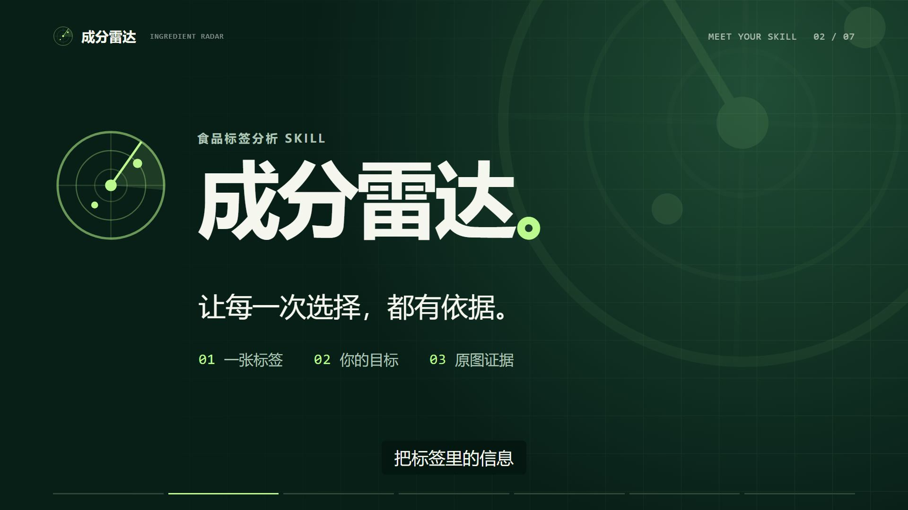

# 成分雷达｜60 秒 Demo 视频

**[打开 / 下载 MP4 成片](https://github.com/Ricardo-100/ingredient-radar-skill/raw/refs/heads/main/docs/media/ingredient-radar-demo.mp4)** 
[仓库内的视频文件](media/ingredient-radar-demo.mp4) · [字幕 SRT](media/ingredient-radar-promo.srt) · [视频源码](../promo-video) · [项目报告书](PROJECT_REPORT.md) · [参赛征文](COMPETITION_ESSAY.md)

链接由 GitHub 托管。浏览器可能直接播放，也可能下载；下载后可用本地播放器打开。仓库同时包含 [HTML 播放页源文件](index.html)，启用 GitHub Pages 后可在网页中播放。

## 视频规格

| 项目 | 内容 |
| --- | --- |
| 时长 | 视频 60 秒；MP4 容器约 60.05 秒 |
| 画幅 | 横屏 1920 × 1080，30 fps |
| 编码 | H.264 + AAC |
| 文件大小 | 9,755,560 字节，约 9.8 MB |
| 声音与字幕 | 中文合成旁白、原创代码配乐、嵌入中文字幕，另附 SRT |
| 演示类型 | Agent 对话流程示意 + 实际脚本结果回放 |

## 观看重点

| 时间 | 内容 |
| --- | --- |
| 00:00–00:06 | “高蛋白”与具体选择之间的问题 |
| 00:06–00:12 | 成分雷达项目介绍 |
| 00:12–00:23 | 提供标签、选择减脂控糖、声明花生忌口 |
| 00:23–00:35 | 60 g 整包换算：每份糖 19.4 g、能量 280 kcal |
| 00:35–00:47 | 花生命中、标签原文和定位区域 |
| 00:47–00:53 | 看不清的字段提示复核 |
| 00:53–01:00 | GitHub 项目入口 |

## 演示依据

画面中的对话为流程示意，项目当前以 Agent Skill 运行，没有独立 App。演示使用仓库合成标签 [sample_wafer.jpg](../samples/sample_wafer.jpg) 和固化抽取 [POS-01.json](../evals/fixtures/POS-01.json)。营养数字与结果图来自实际 Python 脚本回放；不代表本次重新识别，也不是识别准确率评测。

成片制作说明见 [PRODUCTION.md](../promo-video/PRODUCTION.md)，文件信息与校验值见 [manifest.json](media/manifest.json)。

## 提交表单时使用

- 项目及报告书：[项目报告书](https://github.com/Ricardo-100/ingredient-radar-skill/blob/main/docs/PROJECT_REPORT.md)
- 项目 Demo 视频：[本页](https://github.com/Ricardo-100/ingredient-radar-skill/blob/main/docs/DEMO.md)
- 参赛征文：[开发记录](https://github.com/Ricardo-100/ingredient-radar-skill/blob/main/docs/COMPETITION_ESSAY.md)

若活动要求在线播放或指定发布平台，应按活动要求选择入口。仓库的 [GitHub Pages 配置说明](PUBLISHING.md) 提供网页播放器的启用方法。
