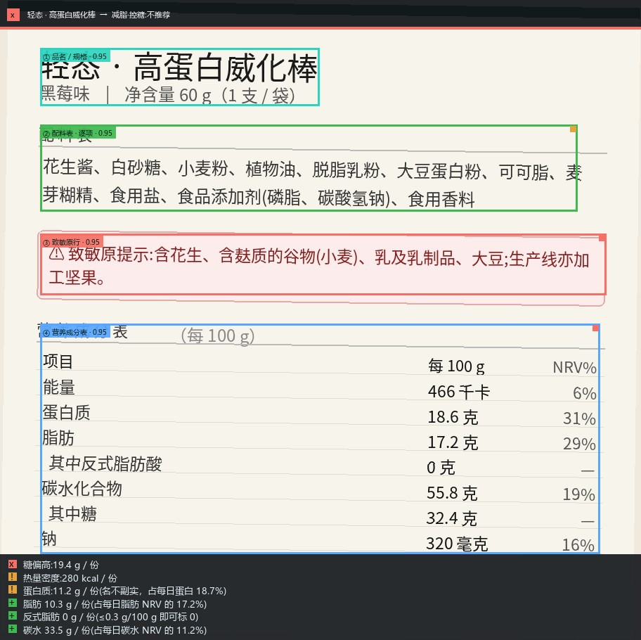

# 成分雷达｜项目报告书

> 项目版本：1.3 · 材料整理日期：2026-09-28<br>
> 项目地址：[Ricardo-100/ingredient-radar-skill](https://github.com/Ricardo-100/ingredient-radar-skill)<br>
> 相关材料：[60 秒 Demo](DEMO.md) · [参赛征文](COMPETITION_ESSAY.md) · [使用说明](../README.md)

## 一、项目概述

成分雷达是面向食品包装标签的 Agent Skill。用户提供标签照片，明确选择增肌、减脂控糖或生酮目标，并声明需要关注的过敏原；系统提取包装上的配料与营养信息，换算实际食用量，输出规则判断及其原图依据。

项目关注三个容易被忽略的问题：包装宣传与营养数字之间的差别、每 100 g 与实际食用量之间的差别，以及结论能否回到标签原文核对。它将这些问题组织成一条可追溯的处理流程。

**当前交付形态是 Skill、Python 脚本及结构化输出。** 使用时需要支持看图的 Agent。Demo 中的对话界面是流程示意，项目尚未提供独立手机 App 或图形化客户端。

## 二、使用场景与交互流程

| 步骤 | 用户或系统操作 | 产出 |
| --- | --- | --- |
| 1. 提供标签 | 用户上传清晰的食品包装标签照片 | 同一张待分析原图 |
| 2. 声明目标 | 用户选择 `gain`、`cut` 或 `keto`，按需声明过敏忌口 | 显式目标和忌口 |
| 3. 读图定位 | Agent 定位品名、配料、致敏原、营养表四类区域，抄录字段 | 结构化 Agent JSON |
| 4. 计算判断 | Python 换算份量，匹配过敏原，按规则计算并检查分歧 | 判定与复核状态 |
| 5. 查看依据 | 返回营养数据、标签原文和带框图片 | 可核对的文字与文件 |

默认按整包计算；用户也可以明确指定本次食用克数。未能读清的字段保留为 `null`，不以零或同类食品的常见数值代替。用户目标必须主动声明，系统不根据照片推断用户的健康状况。

## 三、技术方案

```text
食品标签照片 + 用户声明的目标 / 忌口
                    │
                    ▼
       具备看图能力的 Agent
       区域定位 + 字段抄录 + 初步结论分支
                    │
                    ▼
            --agent-json
                    │
                    ▼
       Python 本地处理
       份量换算 → 规则判定 → 过敏匹配 → 分歧检查
                    │
                    ▼
       contract.json / report.json / result.jpg
```

### 3.1 Agent 与脚本的职责

Agent 根据同一张原图填写结构化 JSON，提供 0–1000 归一化定位框、原文、营养字段及其判断分支。脚本接收这些数据后执行可复算的数值处理与规则检查。只向命令行传一张照片，不能完成图像识别。

规则位于 [scripts/rules.yaml](../scripts/rules.yaml)，字段约定见 [Agent 模式文档](../references/agent-mode.md)。当 Agent 给出的结论分支与本地规则重算出现差异时，输出记录 `verdict_divergence` 并要求人工复核。

### 3.2 依赖与 NVIDIA 软件栈情况

核心处理需要 Python 3.8+；结果图依赖 Pillow。PyYAML 为可选依赖，未安装时由内置解析器处理规则文件。

**当前仓库未集成 CUDA、TensorRT、NVIDIA NIM 或其他 NVIDIA 软件栈。** 脚本没有独立的模型推理端点或 API Key 配置。Agent 平台是否使用 GPU、使用哪种模型以及如何处理图片，取决于所选平台，不能由本仓库推定。

宣传片单独使用 React、Remotion、FFmpeg 和语音合成工具制作；这些是视频制作依赖，不是使用 Skill 所需的依赖。

### 3.3 输出设计

| 文件 | 主要内容 |
| --- | --- |
| `contract.json` | 产品、目标、每 100 g 与每份营养数据、过敏命中、结论、定位证据、规则版本及复核状态 |
| `report.json` | 判定信息与原始 Agent 输入，便于追溯字段来源 |
| `result.jpg` | 标注区域与结果的图片，便于对照原包装 |

终端正常回复最后一行提供 `MEDIA:<绝对路径>`。不符合处理范围的输入会拒判，不生成本次结果图。脚本本身不主动发送网络请求；Agent 的图片处理与数据流向仍由运行平台决定。

## 四、Demo 与可复现结果

本次 Demo 使用仓库内的**合成食品标签样例** [sample_wafer.jpg](../samples/sample_wafer.jpg)，以及已有抽取记录 [POS-01.json](../evals/fixtures/POS-01.json)。通过实际脚本回放生成演示数据和结果图，不代表本次重新调用 Agent 识别了一张新照片。

输入为“减脂控糖”，声明关注“花生”，默认整包 60 g。输出摘要如下：

| 指标 | 每 100 g | 每份 60 g |
| --- | ---: | ---: |
| 能量 | 466 kcal | 280 kcal |
| 糖 | 32.4 g | 19.4 g |
| 蛋白质 | 18.6 g | 11.2 g |
| 脂肪 | 17.2 g | 10.3 g |
| 碳水化合物 | 55.8 g | 33.5 g |
| 钠 | 320 mg | 192 mg |

每份数字按脚本输出精度显示。例如，糖为 `32.4 × 60 / 100 = 19.44 g`，显示为 19.4 g。原文“花生酱”及致敏原提示对应“花生：直接含”；规则结论为“减脂·控糖：不推荐”。这描述的是该样例、该份量、该目标下的项目规则输出。



演示数据可见 [demo-data.json](media/demo-data.json)，其中仅保留用于展示的字段。

### 复现命令

在仓库根目录运行：

```bash
python -m pip install Pillow
python -X utf8 scripts/main.py samples/sample_wafer.jpg --agent-json evals/fixtures/POS-01.json --goal cut --allergen 花生 --out-dir output/promo-demo --json
```

若要分析新的照片，需先让 Agent 根据新照片填写新的 JSON，不能复用此样例的固化抽取。

## 五、演示视频

- 长度：视频轨道 60 秒；容器约 60.05 秒，包含音频编码尾部。
- 画幅：1920 × 1080，横屏，30 fps。
- 内容：提供照片、声明目标与忌口、每份换算、原文证据和不确定性复核。
- 形式：中文旁白、嵌入字幕、对话流程动效与实际结果图。
- 入口：[Demo 说明与 MP4](DEMO.md)。

## 六、完成情况与验证口径

| 项目 | 本次材料中的状态 |
| --- | --- |
| 核心 Skill、规则、字段契约和样例 | 已有源码，随仓库公开 |
| POS-01 回放 | 已运行，视频数字和结果图来自该次输出 |
| 项目 README | 已整理安装、交互、参数与输出说明 |
| 60 秒宣传片 | 已导出；完成类型检查、七场景关键帧检查、完整解码和片内 QR 检查 |
| Agent 对新照片的识别准确率 | 本次没有新增测量，不将固化抽取回放等同于识别准确率评测 |
| 全部评测用例 | 仓库提供评测入口；本报告不新增宣称一次完整回归已通过 |

仓库评测可使用 `python -X utf8 evals/run_evals.py --samples samples --out REPORT.md` 回放。其验证对象是已有抽取记录下的本地判断和输出链路。

## 七、适用边界与后续计划

当前范围是食品包装标签。模糊图片、缺失字段、单位与份量理解错误，以及 Agent 抽取差异都可能影响结果。定位框是复核入口，不能替代正确抽取；模型自报置信度也不是经过校准的准确率。

本项目提供标签信息整理和规则比对，不提供医疗诊断或饮食处方；过敏相关输出需要人工复核原包装。每次食用量与长期饮食安排也不能仅凭一张标签判断。

后续可继续扩展不同版式与模糊程度的样例，测量新照片上的字段抽取质量，完善单位及份量处理，并探索更直接的原图交互。以上属于后续方向，不列为当前已实现功能。
